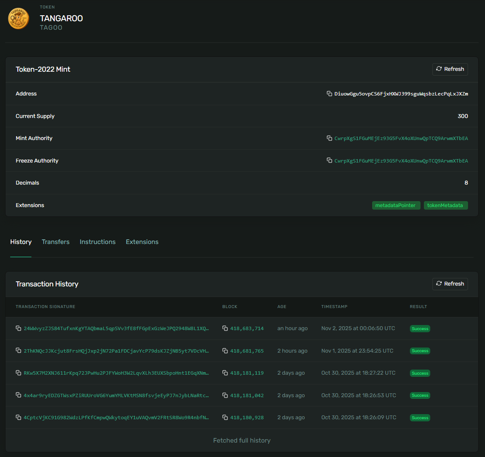
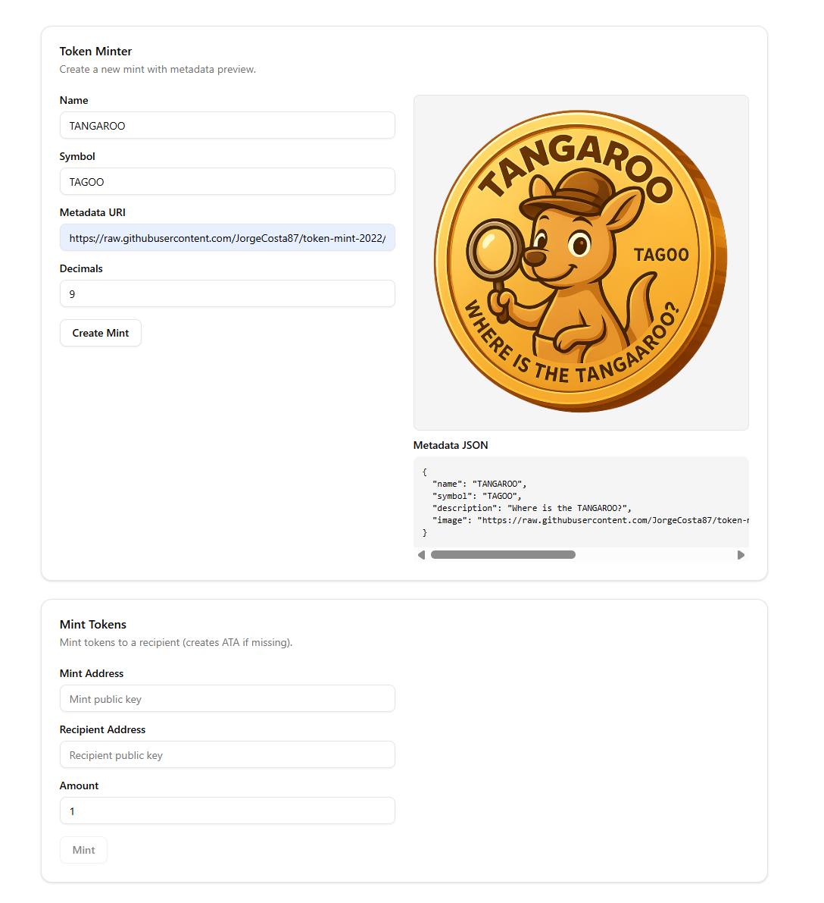

# Token Mint - Token-2022 with Metadata Extensions

A Solana program built with Anchor that creates and mints tokens using Token-2022 with metadata pointer and token metadata extensions.

## Features

- Create Token-2022 mints with configurable decimals
- Initialize on-chain metadata using Token Metadata Extension
- Configure Metadata Pointer Extension to point to the mint account
- Mint tokens to recipient addresses with automatic ATA creation
- Type-safe frontend client generated with Gill and Codama

## Program Overview

The program implements two main instructions:

1. **create_mint**: Creates a new Token-2022 mint with metadata extensions
   - Sets up the mint with specified decimals
   - Initializes token metadata (name, symbol, URI) on-chain
   - Configures metadata pointer extension to reference the mint account

2. **mint_token**: Mints tokens to a recipient
   - Automatically creates associated token account if needed
   - Mints the specified amount using proper decimal scaling

## Token Extensions

This program utilizes Token-2022 extensions for functionality:

### Metadata Pointer Extension
The metadata pointer extension (`extensions::metadata_pointer`) allows the mint account itself to serve as the metadata location, eliminating the need for separate metadata accounts. The pointer is configured to reference the mint account during initialization.

### Token Metadata Extension
Token metadata (name, symbol, URI) is stored directly in the mint account using the Token Metadata Extension. This metadata is initialized via `token_metadata_initialize` CPI call and is accessible on-chain without additional account lookups.

## Technology Stack

### Program (Rust/Anchor)
- Anchor framework for Solana program development
- Token-2022 program via `anchor-spl::token_interface`
- SPL Token Metadata Interface for on-chain metadata

### Frontend (Next.js/TypeScript)
- **Gill**: Type-safe Solana client library for program interaction
- **Codama**: IDL-to-TypeScript code generator that produces type-safe client code from Anchor IDLs
- Wallet integration via `@wallet-ui/react`

The frontend client is automatically generated from the Anchor IDL using Codama, ensuring type safety and consistency between the Rust program and TypeScript client. Gill provides the underlying primitives for building transactions and interacting with Solana programs in a type-safe manner.

## Verified Accounts and Transactions 

### Mint Account
**Address**: [DiuowGgu5ovpCS6FjxHXWJ399sguWqsbzLecPqLxJXZm](https://explorer.solana.com/address/DiuowGgu5ovpCS6FjxHXWJ399sguWqsbzLecPqLxJXZm?cluster=devnet)



### Create Mint Transaction
**Transaction**: [4CptcVjKC91G982WdzLPfKfCmpwQWkytoqEY1uVAQvmV2FRtSR8Wo9R4nbfNZyGtLZbZBRifYn2yZs1UkKBjdES9](https://explorer.solana.com/tx/4CptcVjKC91G982WdzLPfKfCmpwQWkytoqEY1uVAQvmV2FRtSR8Wo9R4nbfNZyGtLZbZBRifYn2yZs1UkKBjdES9?cluster=devnet)

### Mint Token Transaction
**Transaction**: [4x4ar9ryEDZGTWsxPZiRUUroVG6YumYMLVKtMSN8fsvjeEyPJ7nJybLNaRtcEK7N8a6Ve4khRftxTU9nZFL5yCAR](https://explorer.solana.com/tx/4x4ar9ryEDZGTWsxPZiRUUroVG6YumYMLVKtMSN8fsvjeEyPJ7nJybLNaRtcEK7N8a6Ve4khRftxTU9nZFL5yCAR?cluster=devnet)

## Frontend



## Program ID

```
9SwkHfBurrRq7Vw5zQ1QErAatwgdqQdaENDt6saCu8SN
```

## Development

### Build Program
```bash
anchor build
```

### Run Tests
```bash
anchor test
```

### Deploy
```bash
anchor deploy
```

## Running the Frontend

The frontend is a Next.js application located in the `app/token_mint` directory.

### Prerequisites
- Node.js 18+ installed
- Anchor program built (generates the IDL needed for client generation)

### Setup

1. Install dependencies:
```bash
cd app/token_mint
npm install
```

2. Generate TypeScript client from Anchor IDL:
```bash
npx codama run js
```

This uses Codama to generate type-safe client code from the Anchor IDL located at `target/idl/token_mint.json`.

### Run Development Server

```bash
npm run dev
```

The application will be available at `http://localhost:3000`.

### Build for Production

```bash
npm run build
npm start
```

## References

- [Token-2022 Metadata Pointer Example](https://github.com/solana-developers/program-examples/tree/main/tokens/token-2022/nft-meta-data-pointer)
- [Token-2022 Metadata with Anchor](https://github.com/solana-developers/program-examples/tree/main/tokens/token-2022/metadata/anchor/programs/metadata)
